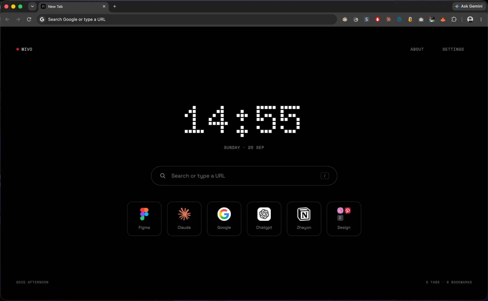
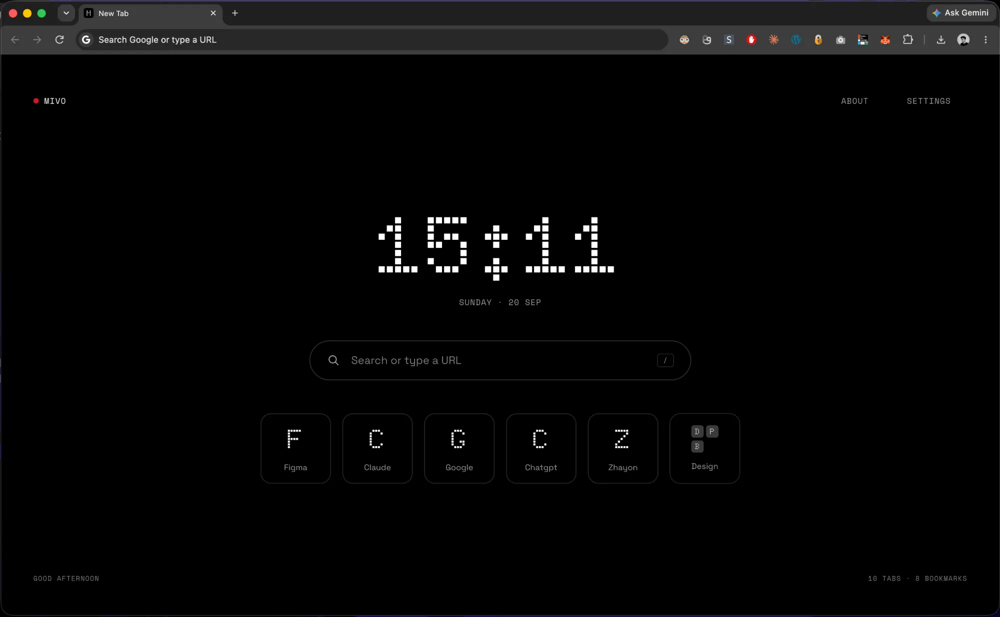
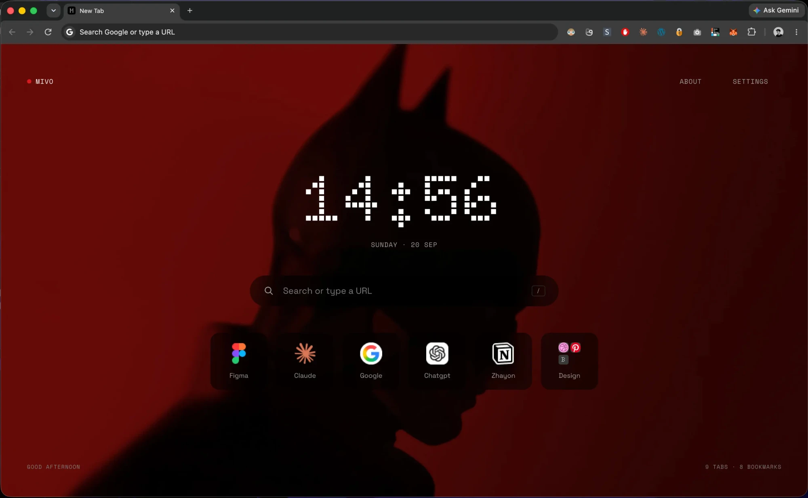
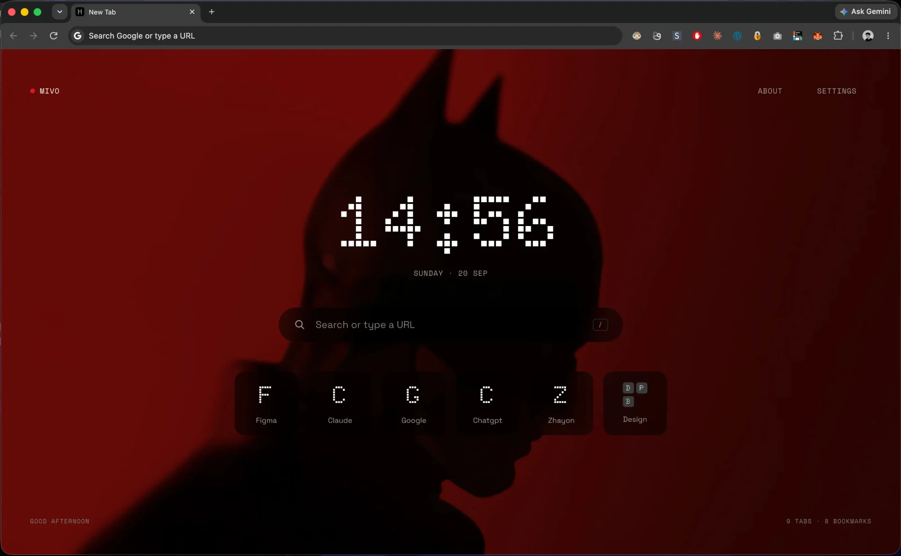

# Mivo

A calm, instant new tab for Chrome. Vanilla TypeScript, no framework, no background worker.



Bookmark styles (favicon or letter tiles), with and without a custom background:

<p>
  
  
</p>
<p>
  
</p>

## Develop

```bash
npm install
npm run build      # outputs dist/
npm run dev        # rebuild on changes in src/
npm run typecheck
npm run icons      # regenerate src/icons/ from scripts/icon.png (macOS, uses `sips`)
```

Load it: `chrome://extensions` → enable Developer mode → **Load unpacked** → pick `dist/`.

## Why it's fast

- `newtab.html` has the CSS and the (subsetted) fonts inlined, so first paint needs no extra requests and no font swap.
- One small script (`newtab.js`, ~10 KB minified), run synchronously at the end of `<body>`, fills the clock and tiles and applies your settings before the first paint.
- No service worker, no content scripts, no runtime dependencies. Permissions: `search` (search box) and `favicon` (read the icon Chrome already has for a bookmarked site).
- Bookmarks live in `localStorage`, which is synchronous, so tiles are in the DOM before the first paint. Favicons are stored with each bookmark as a data URL when it is saved.
- Settings (clock font, bookmark style) are also in `localStorage` and applied before the first paint. The background image is too large for that, so it lives in IndexedDB.
- Dialogs, menus and the folder screens live in a separate `ui.js`, fetched after the first paint (`ui.js` is ~33 KB). Their DOM is built on first use.
- The clock wakes once per minute, on the minute boundary.

## Status

Implemented: header, clock + date, search / URL bar (`/` focuses it), footer greeting and tab / bookmark counts, bookmarks (tiles, add, edit, delete, context menu) and folders (tiles with icon grid, new / edit / delete, move to folder, folder contents view), Settings (clock font: dot or mono; bookmark style: favicon or letter tiles; custom background image with a 60% black cover).
Not yet: About screen; syncing settings and bookmarks across devices.
